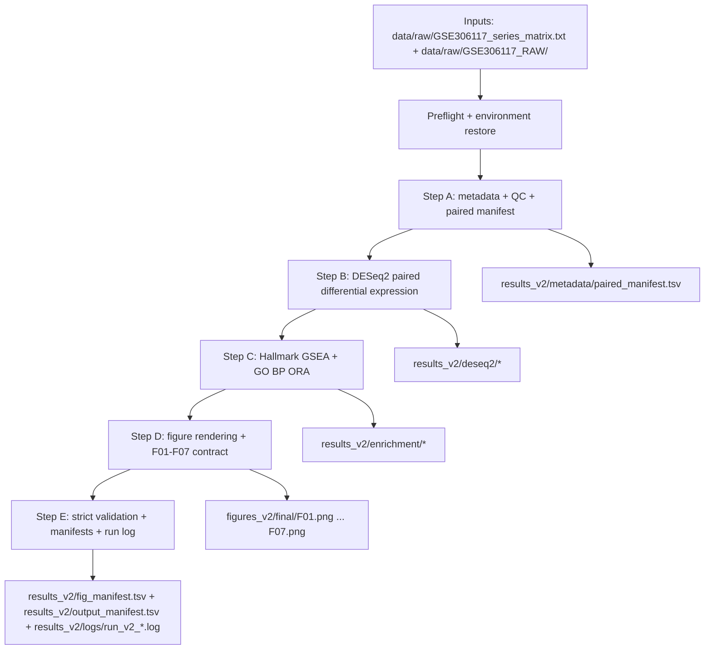

# Workflow v2 — Paired Tumor vs Normal Breast Cancer RNA-seq Pipeline

## Overview

This repository maintains a reproducible v2 RNA-seq workflow for GEO dataset GSE306117, focused on matched Tumor vs Normal breast samples. The analysis pipeline builds a paired cohort manifest, runs paired DESeq2 differential expression, performs Hallmark GSEA plus combined-supplementary and directional GO BP ORA, generates final publication-style figures, and writes strict output manifests.

The maintained entrypoint is:

```bash
bash scripts/run_v2.sh
```

The workflow writes maintained outputs under `results_v2/` and final figure panels under `figures_v2/final/`.

## Workflow Diagram



## Maintained Pipeline Stages

### Preflight and Initialization

`run_v2.sh` performs environment and input checks before Step A:

- Verifies required inputs: `renv.lock`, `data/raw/GSE306117_series_matrix.txt`, `data/raw/GSE306117_RAW/`
- Restores R package state with `renv::restore(prompt=FALSE)`
- Checks required Python packages (`pandas`, `numpy`, `matplotlib`, `sklearn`)
- Creates timestamped log file: `results_v2/logs/run_v2_YYYYmmdd_HHMMSS.log`
- Initializes output directories and archives prior `figures_v2/final/` contents

### Step A — Metadata and Paired Manifest

**Purpose**
Build dataset metadata and derive the paired analysis cohort manifest.

**Key scripts**

- `scripts/00-metadata/01_make_metadata.py`
- `scripts/01-qc/02_merge_htseq_counts.py`
- `scripts/01-qc/03_qc_plots.py`
- `scripts/00-metadata/02_make_sample_manifest_v2.py`

**Expected outputs**

- `data/metadata/sample_manifest.tsv` (intermediate source manifest)
- `results_v2/metadata/paired_manifest.tsv` (canonical paired manifest used downstream)

**Validation performed by `run_v2.sh`**

- Required manifest columns exist
- Manifest has data rows
- `include_paired == TRUE` exists
- Included patients satisfy one Tumor + one Normal sample per patient

### Step B — DESeq2 Paired Differential Expression

**Purpose**
Run paired differential expression on the maintained paired cohort.

**Key script**

- `scripts/02-de/01_deseq2_paired_v2.R`

**Design used**

- `~ patient_id + condition_main`

**Expected outputs (canonical DE location)**

- `results_v2/deseq2/deseq2_paired_v2_results.tsv`
- `results_v2/deseq2/deseq2_paired_v2_samples_used.tsv`
- `results_v2/deseq2/sessionInfo_paired_v2.txt`

**Validation performed by `run_v2.sh`**

- DE table exists, is non-empty, and includes required columns
- `samples_used` exists with required columns
- `samples_used` matches paired-manifest cohort IDs and patient/condition labels

### Step C — Pathway Enrichment (Hallmark GSEA + GO BP ORA)

**Purpose**
Perform downstream biological interpretation from paired DE results.

**Key script**

- `scripts/03-pathways/01_enrichment_paired_v2.R`

**Expected outputs**

- `results_v2/enrichment/hallmark_gsea_paired_v2.tsv`
- `results_v2/enrichment/go_bp_ora_paired_v2.tsv`
- `results_v2/enrichment/sessionInfo_enrichment_paired_v2.txt`

**Validation performed by `run_v2.sh`**

- Both enrichment tables exist and are non-empty files
- Hallmark, combined GO, Tumor-higher GO and Normal-higher GO outputs are non-empty

### Step D — Figure Rendering and Final Naming Contract

**Purpose**
Generate publication-style v2 figures and enforce canonical final panel naming.

**Key scripts**

- `scripts/04-figures/01_publication_figures_paired_v2.R`
- `scripts/04-figures/02_pca_paired_v2.R`
- `scripts/04-figures/03_ma_paired_v2.R`
- `scripts/04-figures/04_volcano_paired_v2.R`
- `scripts/04-figures/05_heatmap_paired_v2.R`
- `scripts/04-figures/06_hallmark_bar_paired_v2.R`
- `scripts/04-figures/07_go_bp_dotplot_paired_v2.R`

**Expected outputs**

- Canonical final figure set in `figures_v2/final/`:
  - `F01.png`
  - `F02.png`
  - `F03.png`
  - `F04.png`
  - `F05.png`
  - `F06.png`
  - `F07.png`

**Contract enforcement by `run_v2.sh`**

- Descriptive source filenames are copied to canonical `F01`–`F07` names
- Non-canonical files are archived out of `figures_v2/final/`

### Step E — Strict Final Validation, Manifests, and Logs

**Purpose**
Enforce output contract and produce traceable manifests/checksums.

**Generated artifacts**

- `results_v2/fig_manifest.tsv` (`figure_id`, path, bytes, md5)
- `results_v2/output_manifest.tsv` (`output_id`, path, bytes, md5)
- `results_v2/logs/run_v2_*.log`

**Validation performed by `run_v2.sh`**

- `figures_v2/final/` contains exactly `F01.png` through `F07.png`
- Required v2 outputs are present and non-empty
- Output manifest generation hard-fails on missing/empty required artifacts

## Canonical Maintained Output Locations

- `results_v2/deseq2/`
- `results_v2/enrichment/`
- `results_v2/metadata/`
- `results_v2/fig_manifest.tsv`
- `results_v2/output_manifest.tsv`
- `results_v2/logs/`
- `figures_v2/final/`

Final figure contract: `figures_v2/final/F01.png` through `figures_v2/final/F07.png`.

## Validation in CI/Local Checks

Use the maintained smoke test:

```bash
bash tests/smoke_test_v2.sh
```

The smoke test runs `bash scripts/run_v2.sh` and checks:

- Pipeline execution success
- Canonical DE outputs
- Enrichment outputs
- Metadata/session/manifests
- Exact final figure set (`F01.png`–`F07.png`, no extras)
- Presence of a non-empty latest run log

## Reproducibility Notes

- `renv.lock` and `renv::restore()` are used for R dependency reproducibility.
- The maintained pipeline exports a single `PIPELINE_SEED` (default `20260227`) to downstream R scripts.
- R scripts are executed with `Rscript --vanilla`.
- Final manifests (`fig_manifest.tsv`, `output_manifest.tsv`) include MD5 checksums and file sizes.
- Timestamped run logs in `results_v2/logs/` provide an execution audit trail.
